# PRVT Chat App: A User's Journey

## Flow 1 - User Registration and Onboarding

1. Alice visits the PRVT Chat App landing page, intrigued by the promise of secure, blockchain-integrated communication.
2. She clicks the "Launch App" button and is presented with options to connect her wallet or sign up with Web3Auth.
3. Alice chooses to use Web3Auth and authenticates with her email.
4. After successful authentication, Alice is prompted to complete her profile.
5. She chooses a username "CryptoAlice" and selects one of her NFTs as a profile picture.
6. The app detects that Alice owns an ENS name and offers her a premium badge, which she accepts.
7. Alice is then guided through a KYC process with Kinto for enhanced verification.
8. Upon completing verification, Alice receives a Kinto ID badge attestation.
9. The app creates an Account Abstraction address for Alice, simplifying her future blockchain interactions.
10. Alice goes through a brief onboarding tutorial, learning about the app's key features.

## Flow 2 - Club Creation and Management

1. Excited about the app's capabilities, Alice decides to create a club for NFT enthusiasts.
2. She activates the Club Creator Agent, which suggests ideas based on her NFT portfolio.
3. Alice provides input about her club's theme, and the AI assists in refining the concept.
4. She sets up NFT-gated membership, requiring members to own at least one NFT from a specific collection.
5. Alice creates a set of entry questions to ensure potential members are knowledgeable about NFTs.
6. The app integrates with Sign Protocol to create attestations for club membership.
7. Alice sets up club activities, including weekly discussions and NFT showcase events.
8. She enables the Galadriel spam remover to keep the club's discussions clean and relevant.
9. Alice receives a creator schema attestation, proving her ownership of the club.
10. She explores options for sharing her club and decides to generate a shareable link with specific permissions.

## Flow 3 - Club Discovery and Joining

1. Bob, another user, logs into the app and is interested in joining some clubs.
2. He activates the Club Finder Agent, which analyzes his interests and NFT holdings.
3. The agent recommends several clubs, including Alice's NFT Enthusiasts club.
4. Bob reviews the club details and decides to apply for membership.
5. The app verifies Bob's NFT ownership to ensure he meets the entry requirements.
6. Bob is presented with Alice's entry questions and successfully answers them.
7. Upon approval, Bob receives a membership attestation through Sign Protocol.
8. He is then guided through a club-specific onboarding process, learning about club rules and features.
9. Bob's membership is confirmed, and he receives an NFT representing his club membership.
10. He explores the club's upcoming events and marks his calendar for the next NFT showcase.

## Flow 4 - Essential In-Club Communication

1. Alice posts a welcome message in the club's chat, which is end-to-end encrypted via XMTP.
2. Bob sees the message and responds, starting a discussion about recent NFT trends.
3. As the conversation grows, the Galadriel spam remover bot quietly filters out a spam message from a new member.
4. Alice shares an interesting insight about NFT marketplaces, and several members, including Bob, "like" her message.
5. The app prompts Bob to verify his account with Kinto to start earning points from likes.
6. Bob completes the Kinto verification process and starts accumulating points as his messages receive likes.
7. The club members engage in a lively discussion, with the most insightful comments rising to the top through likes.
8. Alice notices the high engagement and feels satisfied with the quality of conversation in her club.

## Flow 5 - Standalone dApp Flows

1. Alice decides to introduce some entertainment to her club and activates the zkNoid game.
2. She starts a game session, and club members are notified that they can watch and bet on the outcome.
3. Bob and other members place real-time bets using points issued through the Stackr micro-rollup.
4. As Alice plays, the game's security and fairness are ensured by Mina Protocol and zk-SNARKs.
5. Lit Protocol manages the bet placements and resolutions in real-time.
6. Alice finishes her game with a high score, and winning bettors, including Bob, receive their payouts.
7. Excited by the gaming experience, Bob explores the sports betting section of the app.
8. He joins a group for CHZ token holders interested in long-term sports betting.
9. Bob stakes some of his CHZ tokens into a betting pool for an upcoming major soccer tournament.
10. He places a bet on the tournament outcome, with the transaction securely processed on the Chiliz blockchain.

Throughout this journey, Alice and Bob experience the seamless integration of secure communication, community building, and blockchain-based entertainment, all while maintaining privacy and engaging in rewarding interactions within the PRVT Chat App ecosystem.

---- START FLOW 1 ---- 

```markdown

    # Core Flow 1: User Registration and Onboarding

    ## Overview
    This flow covers the process from a new user landing on the app to completing their profile and being ready to use the main features.

    ## Visual Aid
    [User Registration and Onboarding Flowchart]

    ## Steps

    ### 1. Landing Page Interaction
    **Task**: Implement landing page with call-to-action
    **User Story**: As a new user, I want to understand the app's value proposition and easily start the registration process.

    **Data Objects**:
    - `LandingPageContent`:
    ```typescript
    {
        heroTitle: string;
        heroDescription: string;
        ctaText: string;
        features: Array<{
        title: string;
        description: string;
        iconUrl: string;
        }>;
    }
    ```

    **Subtasks**:
    1. Create responsive landing page layout
    2. Implement hero section with CTA button
    3. Display key features of the app
    4. Add analytics tracking for CTA button clicks

    **Success Criteria**:
    - Page load time < 2 seconds
    - CTA button click rate > 20% of page views

    ### 2. Web3Auth Integration
    **Task**: Implement Web3Auth for user authentication
    **User Story**: As a user, I want to easily authenticate using my email or existing wallet.

    **Data Objects**:
    - `Web3AuthConfig`:
    ```typescript
    {
        clientId: string;
        chainConfig: {
        chainNamespace: string;
        chainId: string;
        rpcTarget: string;
        };
    }
    ```
    - `AuthenticationResult`:
    ```typescript
    {
        userId: string;
        email?: string;
        walletAddress?: string;
        authToken: string;
    }
    ```

    **Subtasks**:
    1. Set up Web3Auth SDK with project credentials
    2. Implement email login flow
    3. Implement wallet connection flow
    4. Handle authentication errors and edge cases

    **Success Criteria**:
    - Authentication process completes in < 5 seconds for 90% of users
    - Successful handling of all potential error scenarios

    ### 3. Profile Creation
    **Task**: Implement profile creation process
    **User Story**: As a new user, I want to set up my profile by choosing a username and profile picture.

    **Data Objects**:
    - `UserProfile`:
    ```typescript
    {
        userId: string;
        username: string;
        profilePicture: string | null;
        bio: string;
        createdAt: Date;
        updatedAt: Date;
    }
    ```

    **Subtasks**:
    1. Create profile creation form UI
    2. Implement username availability check
    3. Add profile picture upload functionality
    4. Integrate with backend API for profile creation

    **Success Criteria**:
    - Username availability check responds in < 500ms
    - 95% of users complete profile creation without errors

    ### 4. ENS Name Integration
    **Task**: Implement ENS name recognition for premium features
    **User Story**: As an ENS name owner, I want the app to recognize my ENS name so I can access premium features.

    **Data Objects**:
    - `ENSDetails`:
    ```typescript
    {
        name: string;
        avatar: string | null;
        address: string;
        isPremium: boolean;
    }
    ```

    **Subtasks**:
    1. Implement ENS name resolution
    2. Create UI for displaying ENS name and avatar
    3. Implement premium badge for ENS name owners
    4. Integrate premium features activation

    **Success Criteria**:
    - ENS resolution completes in < 2 seconds
    - 100% accuracy in premium status assignment for ENS owners

    ### 5. Onboarding Tutorial
    **Task**: Create an interactive onboarding tutorial
    **User Story**: As a new user, I want to understand how to use the app's key features through a guided tutorial.

    **Data Objects**:
    - `TutorialStep`:
    ```typescript
    {
        id: number;
        title: string;
        description: string;
        action: () => void;
    }
    ```

    **Subtasks**:
    1. Design tutorial UI with progress indicators
    2. Implement step-by-step guide for key features
    3. Add skip and "don't show again" options
    4. Track tutorial completion rates

    **Success Criteria**:
    - 80% of new users complete the full tutorial
    - User-reported understanding of key features increases by 50% post-tutorial

    ## Error Handling
    - Implement graceful error handling for network issues during authentication
    - Provide clear error messages for username conflicts or invalid inputs
    - Offer retry options for failed ENS resolutions or profile picture uploads

    ## Testing
    - Unit tests for each component (landing page, authentication, profile creation)
    - Integration tests for the complete registration flow
    - User acceptance testing for the onboarding tutorial

    ## Analytics
    - Track conversion rates from landing page to completed registration
    - Measure time spent on each step of the registration process
    - Monitor ENS name usage and premium feature activation rates

    ### 5. Kinto KYC Integration
    **Task**: Implement Kinto KYC process integration
    **User Story**: As a user, I want to verify my identity using Kinto so that I can access advanced features of the app.

    **Data Objects**:
    - `KYCStatus`:
    ```typescript
    {
        userId: string;
        status: 'pending' | 'verified' | 'rejected';
        lastUpdated: Date;
        verificationId: string;
    }
    ```
    - `VerificationDocuments`:
    ```typescript
    {
        idDocument: File;
        selfie: File;
        additionalDocuments?: File[];
    }
    ```

    **Subtasks**:
    1. Integrate Kinto SDK for KYC process
    2. Implement UI for KYC document upload
    3. Create verification status check and update mechanism
    4. Implement secure document handling and transmission

    **Success Criteria**:
    - KYC process initiation completes in < 3 seconds
    - 90% of users complete the KYC process without errors
    - All document transmissions are encrypted end-to-end

    ### 6. Kinto ID Badge Attestation
    **Task**: Implement Kinto ID badge attestation using Sign Protocol
    **User Story**: As a verified user, I want to receive a Kinto ID badge attestation so that I can prove my verified status across the platform.

    **Data Objects**:
    - `KintoBadgeAttestation`:
    ```typescript
    {
        userId: string;
        badgeType: 'KYC_VERIFIED';
        issuanceDate: Date;
        expirationDate: Date;
        attestationId: string;
    }
    ```

    **Subtasks**:
    1. Integrate Sign Protocol for badge attestation
    2. Implement badge issuance upon successful KYC verification
    3. Create UI for displaying Kinto ID badge
    4. Implement badge verification mechanism

    **Success Criteria**:
    - Badge attestation is issued within 1 minute of KYC approval
    - 100% accuracy in badge verification checks

    ### 7. Account Abstraction with Kinto
    **Task**: Implement Account Abstraction using Kinto
    **User Story**: As a user, I want a simplified blockchain interaction experience so that I can use the app without deep crypto knowledge.

    **Data Objects**:
    - `AbstractAccount`:
    ```typescript
    {
        address: string;
        userId: string;
        creationDate: Date;
        lastActivity: Date;
    }
    ```

    **Subtasks**:
    1. Integrate Kinto SDK for Account Abstraction
    2. Implement UI for managing Abstract Account
    3. Create transaction signing mechanism using Abstract Account
    4. Implement account recovery process

    **Success Criteria**:
    - Abstract Account creation completes in < 10 seconds
    - 99.9% uptime for transaction signing services

    ### 8. Onboarding Tutorial (Updated)
    **Task**: Create an interactive onboarding tutorial including Kinto features
    **User Story**: As a new user, I want to understand how to use the app's key features, including Kinto integration, through a guided tutorial.

    **Data Objects**:
    - `TutorialStep`:
    ```typescript
    {
        id: number;
        title: string;
        description: string;
        action: () => void;
        kintoRelevant: boolean;
    }
    ```

    **Subtasks**:
    1. Design tutorial UI with progress indicators
    2. Implement step-by-step guide for key features, including Kinto KYC and Account Abstraction
    3. Add skip and "don't show again" options
    4. Track tutorial completion rates

    **Success Criteria**:
    - 80% of new users complete the full tutorial
    - User-reported understanding of Kinto features increases by 60% post-tutorial

    ## Error Handling
    - Implement graceful error handling for network issues during authentication and KYC process
    - Provide clear error messages for KYC rejections or document upload failures
    - Offer retry options for failed Kinto ID badge attestations

    ## Testing
    - Unit tests for each component (landing page, authentication, profile creation, Kinto integration)
    - Integration tests for the complete registration flow including Kinto KYC
    - User acceptance testing for the onboarding tutorial with Kinto features

    ## Analytics
    - Track conversion rates from landing page to completed registration and KYC verification
    - Measure time spent on each step of the registration and KYC process
    - Monitor Kinto ID badge issuance and verification rates
    - Track usage of Account Abstraction features
```

---- END FLOW 1 ---- 

---- START FLOW 2 ---- 

This second core flow covers the Club Creation and Management process, including:

1. Club Creator Agent interaction
2. NFT-gated membership setup
3. Club-specific question system
4. Sign Protocol integration for attestations
5. Galadriel spam remover integration
6. Club activity management

The flow provides a comprehensive guide for implementing these features, with detailed steps, data objects, subtasks, and success criteria for each major component.

```markdown

    # Core Flow 2: Club Creation and Management

    ## Overview
    This flow covers the process of creating a new club, setting up membership rules, managing club activities, and integrating various features like NFT-gating, attestations, and spam prevention.

    ## Visual Aid
    [Club Creation and Management Flowchart]

    ## Steps

    ### 1. Club Creator Agent Interaction
    **Task**: Implement the Club Creator Agent
    **User Story**: As a user, I want to use an AI agent to help me create a new club so that the process is easier and more intuitive.

    **Data Objects**:
    - `ClubCreationParams`:
    ```typescript
    {
        name: string;
        description: string;
        rules: string[];
        tags: string[];
        creatorId: string;
        nftRequirements?: {
        contractAddress: string;
        tokenId?: string;
        }[];
    }
    ```
    - `AIResponse`:
    ```typescript
    {
        suggestions: string[];
        reasoning: string;
        recommendedTags: string[];
    }
    ```

    **Subtasks**:
    1. Develop AI model for club suggestions based on user input
    2. Create conversational UI for Club Creator Agent
    3. Implement club creation form with AI-assisted fields
    4. Integrate with backend for storing club data

    **Success Criteria**:
    - AI generates relevant suggestions in < 2 seconds
    - 80% of users find AI suggestions helpful (measured through feedback)

    ### 2. NFT-Gated Membership Setup
    **Task**: Implement NFT-gated membership functionality
    **User Story**: As a club creator, I want to set NFT ownership requirements for club membership to create exclusive communities.

    **Data Objects**:
    - `NFTRequirement`:
    ```typescript
    {
        contractAddress: string;
        tokenId?: string;
        minBalance?: number;
        chain: string;
    }
    ```
    - `MembershipRule`:
    ```typescript
    {
        ruleType: 'NFT' | 'POAP' | 'TOKEN_BALANCE';
        requirement: NFTRequirement | POAPRequirement | TokenBalanceRequirement;
    }
    ```

    **Subtasks**:
    1. Implement NFT ownership verification mechanism
    2. Create UI for setting NFT requirements
    3. Integrate with multiple blockchain networks for NFT checks
    4. Implement caching mechanism for frequent NFT checks

    **Success Criteria**:
    - NFT ownership verification completes in < 3 seconds
    - Support for at least 3 major blockchain networks (Ethereum, Polygon, Binance Smart Chain)

    ### 3. Club-Specific Question System
    **Task**: Implement a dynamic question system for club entry
    **User Story**: As a club owner, I want to set specific questions for potential members to answer so that I can ensure they're a good fit for the club.

    **Data Objects**:
    - `Question`:
    ```typescript
    {
        id: string;
        text: string;
        answerType: 'TEXT' | 'MULTIPLE_CHOICE' | 'BOOLEAN';
        options?: string[];
        timeLimit?: number;
        correctAnswer?: string | boolean;
    }
    ```
    - `Answer`:
    ```typescript
    {
        questionId: string;
        userId: string;
        answer: string | boolean;
        timestamp: number;
    }
    ```

    **Subtasks**:
    1. Create UI for club owners to set up questions
    2. Implement dynamic form generation for answering questions
    3. Develop answer validation mechanism
    4. Integrate time-limited answering functionality

    **Success Criteria**:
    - Support for at least 3 question types (text, multiple-choice, boolean)
    - 95% of users can complete question-answering process without technical issues

    ### 4. Sign Protocol Integration for Attestations
    **Task**: Integrate Sign Protocol for club membership attestations
    **User Story**: As a club member, I want to receive a verifiable attestation of my club membership so that I can prove my affiliation.

    **Data Objects**:
    - `AttestationSchema`:
    ```typescript
    {
        id: string;
        name: string;
        description: string;
        properties: {
        [key: string]: {
            type: string;
            description: string;
        };
        };
    }
    ```
    - `Attestation`:
    ```typescript
    {
        schemaId: string;
        recipient: string;
        attester: string;
        expirationDate?: Date;
        revocationDate?: Date;
        data: object;
    }
    ```

    **Subtasks**:
    1. Implement Sign Protocol SDK integration
    2. Create attestation schema for club membership
    3. Develop attestation issuance process upon successful club join
    4. Implement attestation verification mechanism

    **Success Criteria**:
    - Attestation issuance completes in < 5 seconds
    - 100% accuracy in attestation verification

    ### 5. Galadriel Spam Remover Integration
    **Task**: Implement Galadriel spam remover agent integration
    **User Story**: As a club owner, I want to enable an AI-powered spam filter so that I can maintain the quality of discussions in my club.

    **Data Objects**:
    - `SpamFilter`:
    ```typescript
    {
        clubId: string;
        rules: Array<{
        type: 'KEYWORD' | 'URL' | 'AI_DETECTION';
        threshold: number;
        action: 'FLAG' | 'DELETE' | 'MUTE_USER';
        }>;
    }
    ```
    - `Message`:
    ```typescript
    {
        id: string;
        content: string;
        sender: string;
        timestamp: number;
        spamProbability?: number;
    }
    ```

    **Subtasks**:
    1. Integrate Galadriel AI model for spam detection
    2. Implement real-time message scanning
    3. Create UI for club owners to configure spam filter settings
    4. Develop logging and reporting system for spam detection

    **Success Criteria**:
    - Spam detection occurs in < 500ms per message
    - False positive rate < 1% for spam detection

    ### 6. Club Activity Management
    **Task**: Implement features for managing club activities and engagement
    **User Story**: As a club owner, I want to organize events, create polls, and track member engagement so that I can foster an active community.

    **Data Objects**:
    - `ClubEvent`:
    ```typescript
    {
        id: string;
        clubId: string;
        title: string;
        description: string;
        startTime: Date;
        endTime: Date;
        attendees: string[];
    }
    ```
    - `ClubPoll`:
    ```typescript
    {
        id: string;
        clubId: string;
        question: string;
        options: string[];
        votes: {
        [optionIndex: number]: string[];
        };
        endTime: Date;
    }
    ```
    - `MemberEngagement`:
    ```typescript
    {
        userId: string;
        clubId: string;
        messageCount: number;
        lastActive: Date;
        eventAttendance: number;
        pollParticipation: number;
    }
    ```

    **Subtasks**:
    1. Develop event creation and management system
    2. Implement polling functionality
    3. Create engagement tracking mechanism
    4. Design UI for displaying club activities and engagement metrics

    **Success Criteria**:
    - Event creation process completes in < 30 seconds
    - Poll results update in real-time for 99% of votes
    - Engagement metrics update within 5 minutes of user activity

    ## Error Handling
    - Implement fallback mechanisms for AI agent failures
    - Provide clear error messages for NFT verification issues
    - Handle network disconnections gracefully during attestation processes

    ## Testing
    - Unit tests for each component (Club Creator Agent, NFT verification, attestation issuance)
    - Integration tests for the complete club creation and management flow
    - Load testing for spam filter to ensure performance under high message volume

    ## Analytics
    - Track club creation rates and completion times
    - Measure member acquisition and retention rates for different club types
    - Monitor spam filter effectiveness and false positive/negative rates
    - Analyze correlation between engagement metrics and club growth
```

---- END FLOW 2 ---- 

---- START FLOW 3 ---- 

This third core flow covers the Club Discovery and Joining process, including:

    1. Club Finder Agent implementation
    2. NFT/POAP verification
    3. Club application process
    4. Club-specific question answering
    5. Membership attestation
    6. Club onboarding

    The flow provides a comprehensive guide for implementing these features, with detailed steps, data objects, subtasks, and success criteria for each major component.

```markdown

    # Core Flow 3: Club Discovery and Joining

    ## Overview
    This flow covers the process of discovering relevant clubs, applying for membership, and becoming an active member of a club.

    ## Visual Aid
    [Club Discovery and Joining Flowchart]

    ## Steps

    ### 1. Club Finder Agent
    **Task**: Implement the club finder agent
    **User Story**: As a user, I want to discover clubs that match my interests so that I can join relevant communities.

    **Data Objects**:
    - `UserInterests`:
    ```typescript
    Array<{
        category: string;
        subcategories: string[];
        weight: number; // 0 to 1
    }>
    ```
    - `ClubRecommendation`:
    ```typescript
    {
        id: string;
        name: string;
        description: string;
        matchScore: number; // 0 to 100
        requiredNFTs?: string[];
        memberCount: number;
        activityLevel: 'Low' | 'Medium' | 'High';
    }
    ```

    **Subtasks**:
    1. Develop interest matching algorithm
    2. Implement club search functionality with filters
    3. Create UI for displaying club recommendations
    4. Integrate with user's NFT collection for eligibility pre-checks

    **Success Criteria**:
    - Recommendation algorithm processes 1000+ clubs in < 2 seconds
    - 80% of users find a relevant club within first 5 recommendations

    ### 2. NFT/POAP Verification
    **Task**: Implement NFT and POAP ownership verification
    **User Story**: As a user, I want the app to recognize my owned NFTs and POAPs so that I can access exclusive clubs.

    **Data Objects**:
    - `NFTCollection`:
    ```typescript
    Array<{
        id: string;
        contractAddress: string;
        tokenId: string;
        chain: string;
    }>
    ```
    - `POAPCollection`:
    ```typescript
    Array<{
        id: string;
        eventId: string;
        tokenId: string;
        issuanceDate: Date;
    }>
    ```

    **Subtasks**:
    1. Integrate with multiple blockchain networks for NFT/POAP checks
    2. Implement caching mechanism for frequent ownership checks
    3. Create UI for displaying user's NFT/POAP collection
    4. Develop real-time eligibility updates for club recommendations

    **Success Criteria**:
    - NFT/POAP ownership verification completes in < 3 seconds
    - Support for at least 5 major blockchain networks

    ### 3. Club Application Process
    **Task**: Implement the club application and approval process
    **User Story**: As a user, I want to apply to join clubs and go through their specific entry requirements.

    **Data Objects**:
    - `ClubApplication`:
    ```typescript
    {
        userId: string;
        clubId: string;
        status: 'Pending' | 'Approved' | 'Rejected';
        submissionDate: Date;
        responses: Array<{
        questionId: string;
        answer: string;
        }>;
    }
    ```

    **Subtasks**:
    1. Create UI for club application process
    2. Implement dynamic form generation based on club requirements
    3. Develop application review system for club owners
    4. Integrate with notification system for application status updates

    **Success Criteria**:
    - Application submission process completes in < 1 minute for 90% of users
    - 100% of applications are processed (approved/rejected) within 24 hours

    ### 4. Club-specific Question Answering
    **Task**: Implement the system for answering club-specific questions
    **User Story**: As a prospective club member, I want to answer the club's entry questions accurately and within the specified time limits.

    **Data Objects**:
    - `Question`:
    ```typescript
    {
        id: string;
        text: string;
        answerType: 'TEXT' | 'MULTIPLE_CHOICE' | 'BOOLEAN';
        options?: string[];
        timeLimit?: number;
    }
    ```
    - `UserAnswer`:
    ```typescript
    {
        questionId: string;
        userId: string;
        answer: string | boolean;
        timestamp: number;
        timeTaken: number;
    }
    ```

    **Subtasks**:
    1. Develop timed question-answering interface
    2. Implement answer validation mechanism
    3. Create progress tracking for multi-question applications
    4. Integrate with club's custom scoring system

    **Success Criteria**:
    - 95% of users can complete question-answering process without technical issues
    - Answer submission occurs within 500ms of user input

    ### 5. Membership Attestation
    **Task**: Implement membership attestation using Sign Protocol
    **User Story**: As a new club member, I want to receive a verifiable attestation of my membership so that I can prove my affiliation.

    **Data Objects**:
    - `MembershipAttestation`:
    ```typescript
    {
        userId: string;
        clubId: string;
        issuanceDate: Date;
        expirationDate?: Date;
        attestationId: string;
        metadata: {
        membershipLevel?: string;
        joinDate: Date;
        };
    }
    ```

    **Subtasks**:
    1. Integrate Sign Protocol for attestation issuance
    2. Implement attestation storage and retrieval system
    3. Create UI for displaying membership attestations
    4. Develop verification mechanism for third-party checks

    **Success Criteria**:
    - Attestation issuance completes within 5 seconds of membership approval
    - 100% accuracy in attestation verification checks

    ### 6. Club Onboarding
    **Task**: Implement club-specific onboarding process
    **User Story**: As a new club member, I want to go through an onboarding process to familiarize myself with the club's rules and features.

    **Data Objects**:
    - `ClubOnboarding`:
    ```typescript
    {
        clubId: string;
        steps: Array<{
        id: string;
        title: string;
        description: string;
        completionCriteria: string;
        }>;
    }
    ```
    - `UserOnboardingProgress`:
    ```typescript
    {
        userId: string;
        clubId: string;
        completedSteps: string[];
        startDate: Date;
        completionDate?: Date;
    }
    ```

    **Subtasks**:
    1. Develop customizable onboarding flow for club owners
    2. Create interactive onboarding UI for new members
    3. Implement progress tracking and completion rewards
    4. Integrate with club features to guide initial interactions

    **Success Criteria**:
    - 85% of new members complete onboarding within 24 hours of joining
    - User-reported understanding of club rules increases by 70% post-onboarding

    ## Error Handling
    - Implement retry mechanism for failed NFT/POAP verifications
    - Provide clear feedback for incomplete or incorrect question responses
    - Handle timeouts gracefully during timed question-answering sessions

    ## Testing
    - Unit tests for each component (club finder, NFT verification, question system)
    - Integration tests for the complete club joining flow
    - User acceptance testing for the onboarding process

    ## Analytics
    - Track conversion rates from club discovery to successful membership
    - Measure time spent on each step of the application process
    - Monitor attestation issuance and verification rates
    - Analyze correlation between onboarding completion and long-term member engagement

```

---- END FLOW 3 ----

---- START FLOW 4 ---- 

This revised Flow 4 now focuses on the essential in-club communication features you specified:

1. Encrypted Group Messaging: Using XMTP for secure, decentralized communication.
2. Galadriel Spam Remover Bot: For automated content filtering to maintain chat quality.
3. Point-Based Liking System: With Kinto verification to prevent sybil attacks and ensure fair point distribution.

Key changes and focuses:
- Removed secure file sharing, activity feeds, rich media integration, and extensive content moderation.
- Added detailed implementation of the liking system with Kinto verification for sybil resistance.
- Maintained focus on privacy and security in all communications.
- Kept the integration with the overall secure communication platform of the app.

This streamlined flow provides a focused guide for implementing the core in-club communication features, balancing simplicity with robust privacy and security measures. It sets the stage for the more advanced betting systems in Flow 5 while ensuring that the basic club interaction needs are met.

```markdown

    # Core Flow 4: Essential In-Club Communication

    ## Overview
    This flow covers the core communication features within clubs, focusing on encrypted messaging, spam prevention, and a point-based liking system with sybil resistance.

    ## Key Components

    ### 1. Encrypted Group Messaging
    **Task**: Implement end-to-end encrypted group chat for club members
    **User Story**: As a club member, I want to send and receive encrypted messages within the club to ensure privacy and security.

    **Data Objects**:
    - `Message`:
    ```typescript
    {
        id: string;
        senderId: string;
        content: string;
        timestamp: number;
        likes: number;
    }
    ```
    - `ChatRoom`:
    ```typescript
    {
        id: string;
        clubId: string;
        members: string[];
        messages: Message[];
    }
    ```

    **Subtasks**:
    1. Integrate XMTP for decentralized, encrypted messaging
    2. Implement real-time message synchronization across devices
    3. Develop UI for displaying chat messages and member list

    **Success Criteria**:
    - Messages are end-to-end encrypted
    - Message delivery time < 500ms for 99% of messages
    - Support for group sizes up to 10,000 members

    ### 2. Galadriel Spam Remover Bot
    **Task**: Integrate Galadriel spam remover for automated content filtering
    **User Story**: As a club member, I want protection from spam messages to ensure a high-quality communication experience.

    **Data Objects**:
    - `SpamFilter`:
    ```typescript
    {
        id: string;
        rules: Array<{
        type: 'KEYWORD' | 'PATTERN' | 'AI_DETECTION';
        value: string;
        }>;
    }
    ```
    - `FilteredMessage`:
    ```typescript
    {
        messageId: string;
        reason: string;
        confidence: number;
    }
    ```

    **Subtasks**:
    1. Implement Galadriel AI model for spam detection
    2. Develop real-time message scanning mechanism
    3. Create UI for displaying filtered message notifications
    4. Implement override capability for false positives

    **Success Criteria**:
    - Spam detection occurs in < 200ms per message
    - False positive rate < 1% for spam detection
    - 95% reduction in reported spam messages

    ### 3. Point-Based Liking System with Kinto Verification
    **Task**: Implement a liking system with points and Kinto verification
    **User Story**: As a club member, I want to like messages and earn points for receiving likes, with verification to prevent sybil attacks.

    **Data Objects**:
    - `Like`:
    ```typescript
    {
        id: string;
        messageId: string;
        likerId: string;
        timestamp: number;
    }
    ```
    - `UserPoints`:
    ```typescript
    {
        userId: string;
        points: number;
        lastUpdated: number;
    }
    ```
    - `KintoVerification`:
    ```typescript
    {
        userId: string;
        isVerified: boolean;
        verificationDate: number;
    }
    ```

    **Subtasks**:
    1. Implement liking functionality for messages
    2. Develop point system for received likes
    3. Integrate Kinto verification process
    4. Create UI for displaying likes and user points
    5. Implement anti-sybil measures for point calculation

    **Success Criteria**:
    - Like action completes in < 100ms
    - Points update in real-time for verified users
    - 100% accuracy in preventing unverified users from earning points
    - Kinto verification process completes in < 5 minutes for 90% of users

    ## Integration with Secure Communication Platform

    **Task**: Ensure seamless integration of club communication features with the app's secure communication platform
    **Subtasks**:
    1. Implement end-to-end encryption for all in-club communications
    2. Develop privacy-preserving member list display
    3. Ensure compatibility with existing club discovery and joining mechanisms

    **Success Criteria**:
    - All in-club communications are end-to-end encrypted
    - Member privacy is maintained in UI elements
    - Seamless transition from club joining to in-club communication

    ## Error Handling and Edge Cases
    - Implement message retry mechanism for failed message sends
    - Develop conflict resolution for simultaneous likes on the same message
    - Create fallback for Galadriel bot in case of service disruption

    ## Testing
    - Conduct end-to-end encryption tests for group messaging
    - Perform stress tests simulating high-volume chat scenarios
    - Execute integration tests covering the entire user journey from joining a club to liking messages

    ## Analytics and Monitoring
    - Implement privacy-preserving analytics to track message volume and engagement
    - Develop automated alerts for unusual spikes in spam or liking activity
    - Create dashboard for monitoring overall system health and key performance metrics


```

---- END FLOW 4 ---- 

---- STANDALONE FLOWS ---- 

This revised Flow 5 now focuses specifically on the two betting systems you described:

1. Real-Time Game Betting (zkNoid): 
   - Utilizes Mina Protocol for the zkNoid game
   - Implements Stackr micro-rollup for point management
   - Uses Lit Protocol for handling bets

2. Long-Term Sports Betting:
   - Focuses on CHZ token holders
   - Implements a prediction market for sports events
   - Utilizes Chiliz blockchain for transactions

The flow also emphasizes the integration of these betting systems with the app's secure communication platform, ensuring that all interactions maintain the privacy and security standards of the PRVT Chat App.

Key aspects of this flow:
- Detailed data objects and subtasks for each betting system
- Clear success criteria for each major component
- Emphasis on privacy and security in all betting-related communications
- Consideration of error handling, testing, and analytics

This structure provides a comprehensive guide for implementing these betting systems within the secure chat environment, balancing engaging user experiences with robust privacy and security measures.

```markdown

    # Core Flow 5: Integrated Betting Systems within Secure Communication Platform

    ## Overview
    This flow focuses on implementing two distinct betting systems within the PRVT Chat App's secure and private communication environment: Real-Time Game Betting and Long-Term Sports Betting.

    ## Visual Aid
    [Integrated Betting Systems Flowchart]

    ## 1. Real-Time Game Betting (zkNoid)

    ### Task
    Implement a real-time betting system for the zkNoid game played within chat rooms.

    ### User Story
    As a chat member, I want to play zkNoid and allow other members to bet on my game in real-time, with all interactions being secure and privacy-preserving.

    ### Data Objects
    - `GameState`:
    ```typescript
    {
        gameId: string;
        playerId: string;
        currentScore: number;
        currentLevel: number;
        timeRemaining: number;
    }
    ```
    - `Bet`:
    ```typescript
    {
        betId: string;
        gameId: string;
        bettorId: string;
        amount: number;
        predictedOutcome: 'win' | 'lose' | 'scoreRange';
        scoreRange?: { min: number, max: number };
        timestamp: number;
    }
    ```
    - `GameOutcome`:
    ```typescript
    {
        gameId: string;
        finalScore: number;
        result: 'win' | 'lose';
        proof: string; // ZK proof
    }
    ```

    ### Subtasks
    1. Develop zkNoid game using Mina Protocol for zk-SNARK implementation
    - Implement game logic with provable state transitions
    - Create zk-SNARKs for game state verification
    2. Integrate Stackr micro-rollup for point issuance and management
    - Implement point issuance for game actions and bet winnings
    - Develop system for tracking point balances
    3. Implement real-time betting mechanism using Lit Protocol
    - Create betting smart contract for bet placement and resolution
    - Develop UI for real-time bet placement within chat interface
    4. Integrate game, betting, and point systems with XMTP-based chat
    - Enable seamless game initiation and betting within encrypted chats
    - Implement real-time updates of game state and bet status in chat

    ### Success Criteria
    - Game runs at 60 FPS with zk-SNARK generation taking < 5 seconds
    - Bets are placed and recorded within 500ms of user action
    - Point issuance and balance updates occur within 2 seconds of triggering events
    - All game outcomes are provably fair and verifiable on-chain

    ## 2. Long-Term Sports Betting

    ### Task
    Implement a prediction market for long-term sports betting, exclusive to CHZ token holders.

    ### User Story
    As a CHZ token holder, I want to stake my tokens and participate in long-term sports betting markets within a secure and private group chat environment.

    ### Data Objects
    - `BettingMarket`:
    ```typescript
    {
        marketId: string;
        sportEvent: string;
        options: Array<{ id: string, description: string, odds: number }>;
        totalStaked: number;
        startTime: Date;
        endTime: Date;
        status: 'open' | 'closed' | 'resolved';
    }
    ```
    - `Stake`:
    ```typescript
    {
        stakeId: string;
        userId: string;
        amount: number;
        marketId: string;
        optionId: string;
        timestamp: Date;
    }
    ```
    - `MarketOutcome`:
    ```typescript
    {
        marketId: string;
        winningOptionId: string;
        totalPayout: number;
        resolutionTime: Date;
    }
    ```

    ### Subtasks
    1. Develop CHZ token staking mechanism
    - Implement secure wallet connection for CHZ holders
    - Create staking smart contract on Chiliz blockchain
    2. Implement sports event prediction markets
    - Develop market creation and management system
    - Integrate with sports data oracles for event information and results
    3. Create betting interface within secure group chats
    - Implement UI for browsing markets and placing bets
    - Develop real-time updates for odds and market status
    4. Implement automated market resolution and payout system
    - Create smart contracts for fair and transparent payouts
    - Develop system for returning stakes and distributing winnings

    ### Success Criteria
    - CHZ staking process completes within 30 seconds
    - Market updates (odds, status) propagate to all users within 5 seconds
    - Bet placement confirms within 3 seconds of user action
    - Market resolution and payouts process within 5 minutes of event conclusion

    ## Integration with Secure Communication Platform

    ### Task
    Ensure seamless integration of both betting systems with the app's secure communication features.

    ### Subtasks
    1. Implement end-to-end encryption for all betting-related communications
    - Utilize XMTP for secure message transmission
    - Encrypt bet data and game states in transit and at rest
    2. Develop privacy-preserving leaderboards and activity feeds
    - Use zero-knowledge proofs to verify scores and winnings without revealing user identities
    3. Implement secure and private identity verification for high-stakes bettors
    - Integrate KYC process that maintains user privacy
    - Develop zero-knowledge proof system for age and location verification

    ### Success Criteria
    - All betting-related communications are end-to-end encrypted
    - Leaderboards update within 1 minute of game/market resolution without compromising user privacy
    - KYC process completes within 24 hours with 100% data privacy preservation

    ## Error Handling and Edge Cases
    - Implement fallback mechanisms for network issues during live betting
    - Develop conflict resolution system for disputed game outcomes or market resolutions
    - Create secure backup and recovery system for user points and stakes

    ## Testing
    - Conduct comprehensive security audits on all smart contracts
    - Perform stress tests simulating high-volume betting scenarios
    - Execute integration tests covering the entire user journey from chat to betting to payout

    ## Analytics and Monitoring
    - Implement privacy-preserving analytics to track user engagement and system performance
    - Develop automated alerts for unusual betting patterns or potential security issues
    - Create dashboard for monitoring overall system health and key performance metrics

```

---- END FLOW 5 ---- 

Expected project structure to be delivered

src/
├── app/
│   ├── api/
│   │   ├── auth.ts                 [Web3Auth, Kinto]
│   │   ├── clubs.ts                [Sign Protocol, Stackr, Chiliz]
│   │   └── messages.ts             [XMTP, Lit Protocol, Galadriel]
│   ├── chat/
│   │   └── page.tsx                [XMTP, Lit Protocol, Galadriel]
│   ├── clubs/
│   │   └── page.tsx                [Sign Protocol, Stackr, Chiliz, ZkNoid]
│   ├── complete-profile/
│   │   └── page.tsx                [Web3Auth, Kinto]
│   ├── home/
│   │   └── page.tsx                [All prizes integrated]
│   ├── layout.tsx                  [General layout, no specific prize]
│   └── page.tsx                    [Landing page, Web3Auth]
├── components/
│   ├── ActiveSession.tsx           [Web3Auth, XMTP]
│   ├── ClubCreator.tsx             [Sign Protocol, Stackr, Chiliz, ZkNoid]
│   ├── ClubFinder.tsx              [Sign Protocol, Stackr, Chiliz, ZkNoid]
│   ├── ConnectWalletButton.tsx     [Web3Auth, Kinto]
│   ├── Conversation.tsx            [XMTP, Lit Protocol]
│   ├── GaladrielSpamRemover.tsx    [Galadriel]
│   ├── Header.tsx                  [General component, no specific prize]
│   ├── KintoVerification.tsx       [Kinto]
│   └── VerifyButton.tsx            [Kinto, Sign Protocol]
├── hooks/
│   ├── useNFTs.ts                  [Web3Auth, ZkNoid]
│   ├── useWeb3Auth.ts              [Web3Auth]
│   └── useXMTP.ts                  [XMTP]
└── lib/
    ├── signProtocol.ts             [Sign Protocol]
    ├── stackr.ts                   [Stackr]
    └── utils.ts                    [General utilities, no specific prize]

Prize Mapping:

- Mina Protocol (ZkNoid SDK):
-- src/app/clubs/page.tsx
-- src/components/ClubCreator.tsx
-- src/components/ClubFinder.tsx
-- src/hooks/useNFTs.ts

- Sign Protocol:
-- src/app/api/clubs.ts
-- src/app/clubs/page.tsx
-- src/components/ClubCreator.tsx
-- src/components/ClubFinder.tsx
-- src/components/VerifyButton.tsx
-- src/lib/signProtocol.ts

- Galadriel:
-- src/app/api/messages.ts
-- src/app/chat/page.tsx
-- src/components/GaladrielSpamRemover.tsx

- Lit Protocol:
-- src/app/api/messages.ts
-- src/app/chat/page.tsx
-- src/components/Conversation.tsx

- Kinto:
-- src/app/api/auth.ts
-- src/app/complete-profile/page.tsx
-- src/components/ConnectWalletButton.tsx
-- src/components/KintoVerification.tsx
-- src/components/VerifyButton.tsx

- Chiliz:
-- src/app/api/clubs.ts
-- src/app/clubs/page.tsx
-- src/components/ClubCreator.tsx
-- src/components/ClubFinder.tsx

- XMTP:
-- src/app/api/messages.ts
-- src/app/chat/page.tsx
-- src/components/ActiveSession.tsx
-- src/components/Conversation.tsx
-- src/hooks/useXMTP.ts

- Web3Auth:
-- src/app/api/auth.ts
-- src/app/complete-profile/page.tsx
-- src/app/page.tsx
-- src/components/ActiveSession.tsx
-- src/components/ConnectWalletButton.tsx
-- src/hooks/useNFTs.ts
-- src/hooks/useWeb3Auth.ts

- Stackr:
-- src/app/api/clubs.ts
-- src/app/clubs/page.tsx
-- src/components/ClubCreator.tsx
-- src/components/ClubFinder.tsx
-- src/lib/stackr.ts

This structure and mapping show how each prize requirement is integrated into different parts of the application. The src/app/home/page.tsx is listed as integrating all prizes because it serves as the main dashboard where users can access all features of the app.

--- class diagram

```mermaid
classDiagram
    class UserProfile {
        +string username
        +string profilePicture
        +any preferences
        +handleUsernameChange(username: string): void
        +handleProfilePictureSelect(picture: string): void
        +submitProfile(): Promise<void>
    }

    class Web3AuthState {
        +any user
        +any provider
        +any web3auth
        +initializeWeb3Auth(): Promise<void>
        +login(): Promise<void>
        +logout(): Promise<void>
        +getUserInfo(): Promise<any>
    }

    class ConnectionStatus {
        +boolean isConnected
        +string address
        +handleConnect(): Promise<void>
        +handleDisconnect(): Promise<void>
    }

    class ENSDetails {
        +string name
        +string avatar
        +resolveENS(address: string): Promise<ENSDetails | null>
        +checkPremiumEligibility(ensName: string): Promise<boolean>
    }

    class ChatList {
        +Array<Chat> chats
        +fetchChats(): Promise<ChatList>
    }

    class Chat {
        +string id
        +string name
        +string lastMessage
    }

    class AgentList {
        +Array<Agent> agents
        +fetchAgents(): Promise<AgentList>
    }

    class Agent {
        +string id
        +string name
        +string description
    }

    class ClubList {
        +Array<Club> clubs
        +fetchLatestClubs(): Promise<ClubList>
    }

    class Club {
        +string id
        +string name
        +number memberCount
        +string description
        +Array<string> rules
        +Array<string> tags
    }

    class ClubService {
        +createClub(params: ClubCreationParams): Promise<string>
        +generateClubIdeas(userPortfolio: NFTCollection): Promise<AIResponse>
        +setVerificationRules(clubId: string, rules: VerificationRule[]): Promise<void>
        +checkUserEligibility(userId: string, clubId: string): Promise<boolean>
    }

    class ClubRecommendation {
        +findClubs(interests: UserInterests): Promise<ClubRecommendation[]>
        +joinClub(clubId: string): Promise<void>
    }

    class NFTCollection {
        +Array<NFT> nfts
        +fetchUserNFTs(address: string): Promise<NFTCollection>
    }

    class POAPCollection {
        +Array<POAP> poaps
        +fetchUserPOAPs(address: string): Promise<POAPCollection>
    }

    class Attestation {
        +createAttestationSchema(schema: AttestationSchema): Promise<string>
        +issueAttestation(attestation: Attestation): Promise<string>
        +verifyAttestation(attestationId: string): Promise<boolean>
    }

    class UserPointBalance {
        +recordPointTransaction(transaction: PointTransaction): Promise<void>
        +getUserPointBalance(userId: string): Promise<UserPointBalance>
    }

    class KYCStatus {
        +initiateKYC(userId: string): Promise<void>
        +submitVerificationDocuments(documents: VerificationDocuments): Promise<void>
        +checkVerificationStatus(userId: string): Promise<KYCStatus>
    }

    class GaladrielContract {
        +deployGaladrielContracts(): Promise<GaladrielContract>
        +upgradeContracts(newVersion: string): Promise<void>
    }

    class XMTPService {
        +initializeXMTP(): Promise<void>
        +sendMessage(conversation: Conversation, content: string): Promise<void>
        +listenForMessages(conversation: Conversation): AsyncGenerator<XMTPMessage>
    }

    class LitProtocolService {
        +encryptMessage(message: string, accessControlConditions: AccessControlConditions): Promise<EncryptedMessage>
        +decryptMessage(encryptedMessage: EncryptedMessage, accessControlConditions: AccessControlConditions): Promise<string>
        +createLitAction(clubId: string, action: LitAction): Promise<string>
        +executeLitAction(actionId: string, user: any): Promise<boolean>
    }

    class SportClub {
        +deployClubContract(clubData: SportClub): Promise<string>
        +createChallenge(clubId: string, challengeData: Challenge): Promise<string>
        +participateInChallenge(userId: string, challengeId: string): Promise<void>
    }

    class ZkNoidService {
        +generateMembershipProof(userId: string, clubId: string): Promise<MembershipProof>
        +verifyMembershipProof(proof: MembershipProof): Promise<boolean>
    }

    class KintoWalletService {
        +connectKintoWallet(): Promise<KintoWallet>
        +disconnectKintoWallet(): Promise<void>
    }

    class MFAService {
        +enableMFA(userId: string, method: string): Promise<void>
        +verifyMFACode(userId: string, code: string): Promise<boolean>
    }

    class BettingSystem {
        +placeBet(userId: string, betDetails: BetDetails): Promise<void>
        +resolveBet(betId: string, outcome: BetOutcome): Promise<void>
    }

    UserProfile --> Web3AuthState : authenticates with
    Web3AuthState --> ConnectionStatus : manages
    UserProfile --> ENSDetails : resolves
    UserProfile --> NFTCollection : owns
    UserProfile --> POAPCollection : owns
    UserProfile --> KYCStatus : verifies with
    UserProfile --> UserPointBalance : tracks
    ChatList --> Chat : contains
    AgentList --> Agent : lists
    ClubList --> Club : lists
    ClubService --> Club : manages
    ClubRecommendation --> UserInterests : based on
    Club --> Attestation : issues
    Club --> ZkNoidService : uses for membership proof
    SportClub --|> Club : extends
    XMTPService --> Chat : facilitates
    LitProtocolService --> Chat : encrypts
    GaladrielContract --> Chat : filters spam in
    BettingSystem --> SportClub : operates on
    KintoWalletService --> UserProfile : provides wallet for
    MFAService --> UserProfile : secures
```


